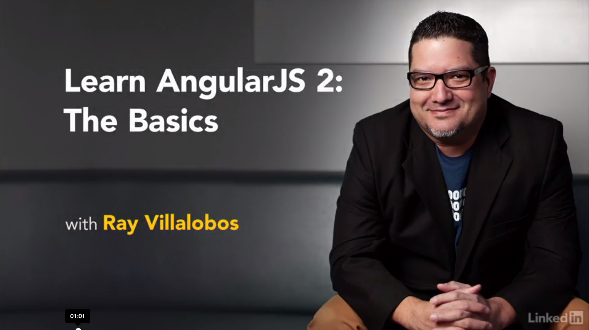

# Up and Running with AngularJS

This is the repository for my course, [Up and Running with AngularJS](http://www.lynda.com/AngularJS-tutorials/Up-Running-AngularJS/154414-2.html). The full course is available at [lynda.com](http://lynda.com).

## Course Description
Get a fresh look at AngularJS, a "superheroic" framework for building single-page web applications fast. Ray Villalobos shows you how to understand the practical uses of AngularJS with a directory search project—a traditional type of web app you can add to your existing sites. He defines the MVC architecture underlying AngularJS: the model (your data), views (how data is flowed into your template), and controllers (the JavaScript that links the two together). You then learn how to divide your project into modules; work with services like $http, $routeProvider, and animation; and set up deep linking and navigation. Start now, and learn the simple way to build your own complex web application.

## Topics include:
- What is AngularJS?
- Working with complex models
- Using a the $http service to read a JSON file
- Binding data
- Dividing your app into partials
- Creating a details template
- Using AngularJS animation events

## Instructions
This repository has branches for each of the videos in the course. You can use the branch pop up menu in github to switch to a specific branch and take a look at the course at that stage. Or you can simply add `/tree/BRANCH_NAME` to the URL to go to the branch you want to peek at.

1. Make sure you have these installed
	- [node.js](http://nodejs.org/)
	- [git](http://git-scm.com/)
	- [gulp](http://gulpjs.com/)
2. Clone this repository into your local machine using the terminal (mac) or Gitbash (PC) `> git clone https://github.com/planetoftheweb/angular.git`
3. CD to the folder `cd angular`
4. Run `npm install` to install the project dependencies
5. Run the Gulp command `> gulp`

For more help setting up a comprehensive Gulp.js workflow, check out [Web Project Workflows with Gulp.js, Git, and Browserify](http://www.lynda.com/Web-Web-Design-tutorials/Web-Project-Workflows-Gulpjs-Git-Browserify/154416-2.html).

## More Stuff
Check out some of my [other courses on lynda.com](http://lynda.com/rayvillalobos). You can also check out my [youtube channel](http://youtube.com/planetoftheweb), [follow me on twitter](http://twitter.com/planetoftheweb), or read [my blog](http://raybo.org).
